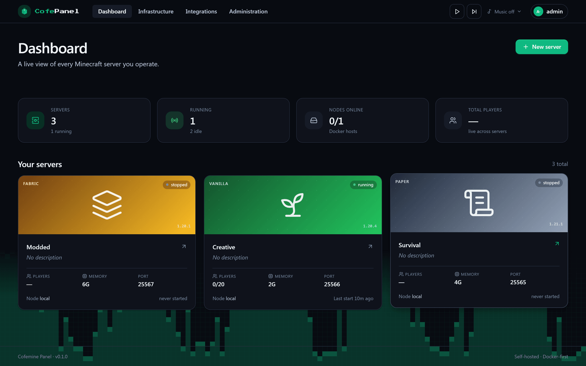
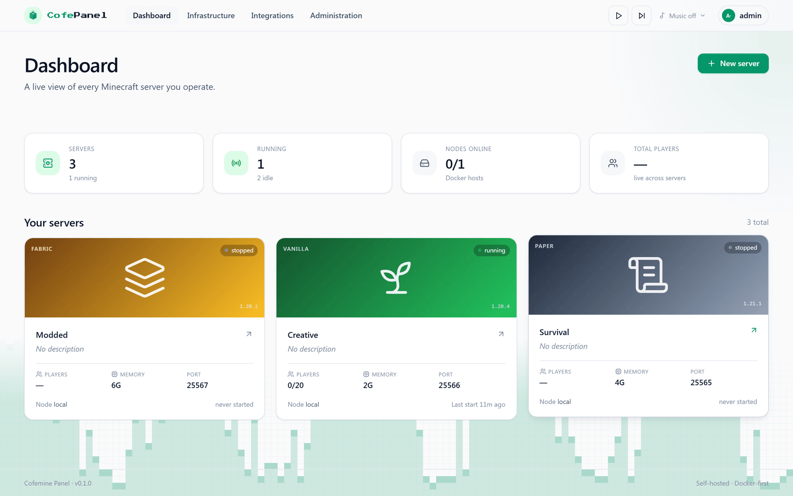
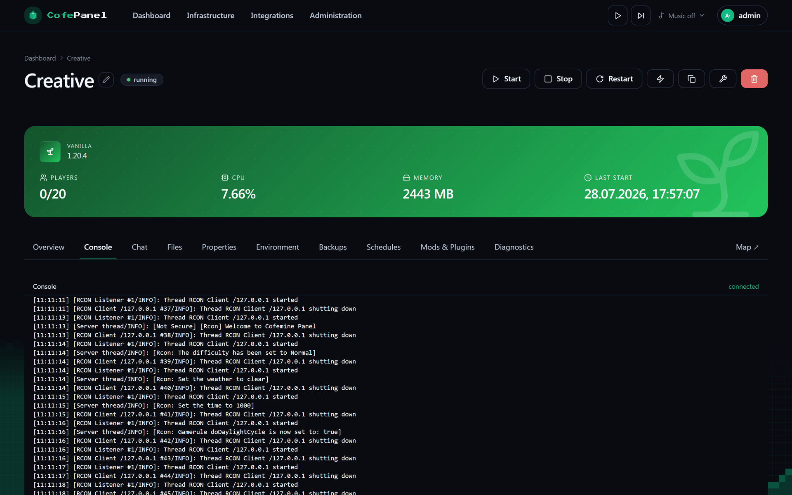
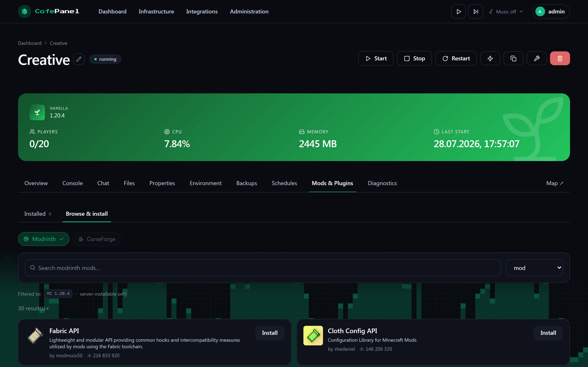
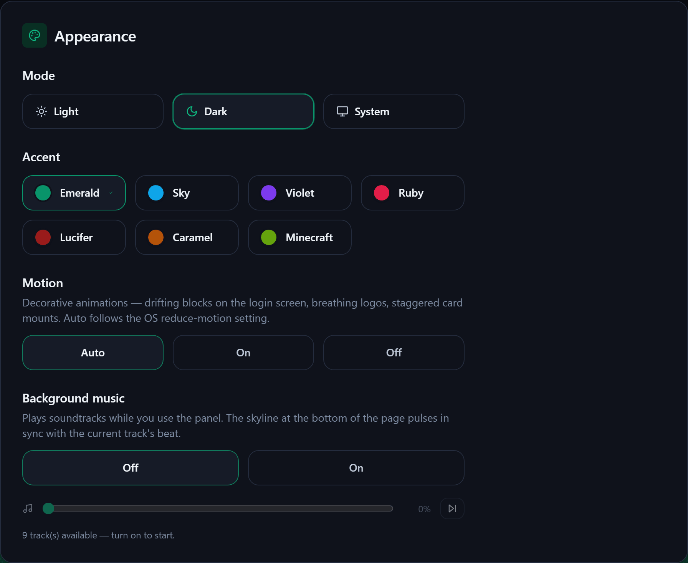

<div align="center">

# Cofemine Panel

**Self-hosted, Docker-first control panel for Minecraft servers.**

Spin up Vanilla / Paper / Purpur / Fabric / Forge / NeoForge / Mohist / Quilt servers as sibling
containers — each with a live console, file manager, backups, scheduled tasks, live world maps and
Modrinth / CurseForge content installers.

[](LICENSE)
[](https://nodejs.org)
[](https://nextjs.org)
[](https://fastify.dev)
[](https://www.postgresql.org)
[](https://docs.docker.com/compose/)

[Quick start](#quick-start) · [Architecture](#architecture) · [Security](#security) · [Docs](#documentation)

</div>

---

> **Status: MVP, in active development.** The architecture, data model, API surface and the happy path
> (create → start → console → edit `server.properties` → back up) all work. Single-node in practice,
> multi-node-ready by schema. See the [roadmap](docs/roadmap.md).

## Features

| | |
|---|---|
| **Server lifecycle** | Create, start, stop, restart, kill and clone servers. Each one is a sibling [`itzg/minecraft-server`](https://github.com/itzg/docker-minecraft-server) container behind a `MinecraftRuntimeProvider` abstraction. |
| **Live console & chat** | WebSocket-proxied container stdout with command autocomplete and per-server history; a dedicated chat tab with player heads and day separators. |
| **File manager** | Browse, edit, upload and delete files under the server's data directory, with chunked uploads for large jars. |
| **Backups** | On-demand and scheduled `tar.gz` archives, retention policies, one-shot prune, and restore back into the server. |
| **Scheduler** | Cron-driven restarts, commands, announcements and backups, with authorship recorded and re-checked before every run. |
| **Content installers** | Modrinth and CurseForge search, version filtering by game version and loader, modpack installs, and a client-side `.mrpack` exporter for your players. |
| **Live maps** | BlueMap / dynmap proxied through a dedicated process so tile storms never stall the panel API. |
| **RBAC & audit** | Owner / admin / operator / viewer at global and per-server scope, enforced server-side only, with an append-only audit log. |
| **Theming & i18n** | Light, dark and system modes across seven accent colours; English and Russian throughout. |

## Screenshots

The interface ships three appearance modes — **light**, **dark** and **system** — layered with seven
accent colours (Emerald, Sky, Violet, Ruby, Lucifer, Caramel and Minecraft), all switchable at runtime
from the appearance menu.

<!--
  Drop the captures into docs/images/ using the names below, then delete this comment block
  to publish them. docs/images/README.md lists exactly which screens to capture and how.

<div align="center">
  
  
</div>

<div align="center">
  
  
</div>

<div align="center">
  
</div>
-->

> Screenshots are not committed yet — see [`docs/images/README.md`](docs/images/README.md) for the
> capture checklist and file names the markdown above already expects.

## Quick start

```bash
git clone https://github.com/cofedish/cofemine-panel.git
cd cofemine-panel
cp .env.example .env
```

Fill in the three secrets the stack refuses to boot without — the API validates them at startup and
rejects the placeholder values:

```bash
# 32 bytes of base64, used to encrypt integration secrets at rest
openssl rand -base64 32     # → SECRETS_KEY
# at least 32 characters
openssl rand -hex 32        # → JWT_SECRET
openssl rand -hex 32        # → AGENT_TOKEN
```

Then bring the stack up:

```bash
docker compose up --build
```

Open <http://localhost:3000> and complete first-run setup. The local node registers itself from
compose. For a production deployment behind Caddy, see [deployment](docs/deployment.md) and
[`docs/Caddyfile.example`](docs/Caddyfile.example).

## Architecture

One Compose project, six services. The browser only ever talks to `web`; the Docker socket is
reachable from exactly one container.

```
        Browser
           │  same-origin /api/* (httpOnly cookie)
           ▼
    ┌─────────────┐         ┌──────────────┐
    │     web     │────────►│  map-proxy   │  BlueMap / dynmap tiles
    │  (Next.js)  │         │  (:4500)     │  on their own event loop
    └──────┬──────┘         └──────┬───────┘
           │ /api/*                │
           ▼                       │
    ┌─────────────┐   Prisma  ┌────▼─────┐
    │     api     │──────────►│    db    │  Postgres 16
    │  (Fastify)  │           └──────────┘
    └──────┬──────┘
           │  Bearer AGENT_TOKEN
           ▼
    ┌─────────────┐
    │    agent    │  the only container with docker.sock
    │ (dockerode) │
    └──────┬──────┘
           │ Docker Engine API
           ▼
    ┌──────────────────────────┐     ┌───────────────┐
    │ itzg/minecraft-server ×N │────►│  maven-cache  │  caching + MITM proxy
    │   one per game server    │     │ nginx + squid │  for loader / CDN pulls
    └──────────────────────────┘     └───────────────┘
```

**Boundaries that are enforced, not conventional:** only the agent may touch Docker; only the API may
touch Postgres; the web app is a pure API client with no backend logic; and authorization lives
server-side only — the UI deliberately does not hide controls by role.

Full write-up: [docs/architecture.md](docs/architecture.md).

## Security

This panel manages Docker containers on the host, and a Minecraft server runs mod jars — unmoderated
third-party code from CurseForge and Modrinth — inside its own process. The security model is written
around that fact rather than around the panel's own login form.

What is in place today:

- **Sessions** — bcrypt (cost 12), JWT pinned to HS256 plus a server-side session row, httpOnly
  `SameSite=Lax` cookies, per-account login throttling scoped by source address.
- **Authorization** — an allowlist permission matrix; global roles grant per-server access only for
  owner and admin, so scoped roles genuinely need a membership.
- **Secrets** — AES-256-GCM at rest, secret env keys redacted on every response, and a masked value
  cannot be written back over the real one.
- **Container bounds** — MC containers run with `no-new-privileges`, all capabilities dropped except
  the seven itzg needs, a pid limit, memory and swap pinned, log rotation, a random per-container RCON
  password, and env keys that would let the process become root are rejected in two layers.
- **Supply chain** — the lockfile is enforced in CI and in every image build, transitive advisories are
  pinned through overrides, and CI type-checks before any image is pushed.
- **Egress** — loader and CDN downloads go through a caching proxy that verifies upstream certificates,
  refuses to act as an open proxy, and never intercepts Mojang session traffic.

What is knowingly **not** solved is written down too, including why: see
[docs/security.md](docs/security.md), which covers the Docker socket's root equivalence, the map
iframe's origin problem, and the remaining major dependency migrations.

Found a vulnerability? Please read [SECURITY.md](SECURITY.md) before opening a public issue.

## Repository layout

```
apps/
  api/           Fastify 4 + Prisma 5 + Zod — auth, RBAC, audit, scheduler, content providers
  agent/         Fastify + dockerode node-agent — the only service with docker.sock
  web/           Next.js 14 App Router UI — pure API client, no backend logic
  docker-shim/   scaffold: isolating Docker access from the agent's larger surface (not yet wired)
packages/
  shared/        zod schemas, role/permission matrix, server types — shipped as raw TypeScript
services/
  maven-cache/   nginx + squid + gost caching proxy for loader and CDN downloads
docs/            architecture, deployment, API, security, roadmap
docker-compose.yml        dev stack
docker-compose.prod.yml   production stack (images from GHCR, behind Caddy)
```

## Supported runtimes

Vanilla · Paper · Purpur · Fabric · Forge · NeoForge · Mohist · Quilt — driven through
`itzg/minecraft-server` environment variables, plus Modrinth and CurseForge modpack sources. New
runtimes are added by implementing `MinecraftRuntimeProvider`.

## Development

```bash
pnpm install
pnpm dev          # tsx watch + next dev (needs local Postgres and a filled .env)
pnpm typecheck    # tsc --noEmit across all workspaces — the de-facto quality gate
pnpm build        # full build
```

There is no test runner in the repository yet; verification is `pnpm typecheck` plus a Compose smoke
run. See [development](docs/development.md) for the longer version.

## Documentation

| Document | What it covers |
|---|---|
| [Architecture](docs/architecture.md) | Services, data flows, trust boundaries |
| [Development](docs/development.md) | Local setup, workspace layout, conventions |
| [Deployment](docs/deployment.md) | Production Compose, Caddy, environment |
| [API reference](docs/api.md) | REST surface and WebSocket endpoints |
| [Security model](docs/security.md) | Threat model, what is enforced, what is not |
| [Hardening plan](docs/security-hardening-plan.md) | Audit findings, status, what remains |
| [CI/CD](docs/ci-cd.md) | Build, image publishing, auto-deploy |
| [Pack integration](docs/pack-integration.md) | Client `.mrpack` export and public pack links |
| [Roadmap](docs/roadmap.md) | Planned work |

## License

[MIT](LICENSE).
